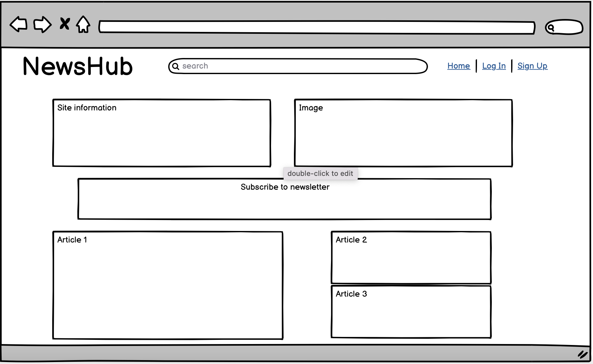

# News Hub

News Hub is a website created in a Reddit style blog format to allow users to view and create posts for others to read, comment and like on.

The site is fully responsive and designed in a simplistic and easy to navigate manner. It has been coded using HTML, CSS, Python and Django and the Bootstrap frameworks.

Below is a screenshot of the finished project generated using [Am I Responsive](https://ui.dev/amiresponsive):

# UX

## User Stories

As a **Site Admin** I can **create draft posts** so that **I can finish writing the content later.**

As a **Site Admin** I can **create, read, update and delete posts** so that **I can manage my blog content.**

As a **Site Admin** I can **approve or disapprove comments** so that **I can filter out objectionable comments.**

As a **Site User/ Admin** I can **view the number of likes on each post** so that **I can see which is the most popular or viral.**

As a **Site User/ Admin** I can **view comments on an individual post** so that **I can read the conversation.**

As a **Site User** I can **register an account** so that **I can comment and like.**

As a **Site User** I can **leave comments on a post** so that **I can be involved in the conversation.**

As a **Site User** I can **like or unlike a post** so that **I can interact with the content.**

As a **Site User** I can **view a list of posts** so that **I can select one to read.**

As a **Site User** I can **view a paginated list of posts** so that **easily select a post to view.**

As a **Site User** I can **click on a post** so that **I can read the full text.**

# Agile Planning Environment

## MosCow Method

Using GitHub's useful project board I could ensure that I followed the MosCow method to justify each of my actions through the project. This helped keep good structure during the project development process.

As I was creating a blog style project the User Stories were taking from a previous walkthrough project.

Here is a screenshot of the environment

# Design

The colour scheme was selected to be cool and basic as to not take the focus away from the content that is important on the screen (these being the blog posts).

## NewsHub Design

The design was made to be clean and easy to navigate and view. Keeping the colour scheme simple and consistent across the site. Areas of importance stand out by using a strong blue colour to highlight them, where areas of less focus are kept simple and clean using pale colours.

# Colour Scheme

The colour scheme was kept clean to keep the focus on the articles on the site and not what their surroundings are.

# Typography

The typography on the site was used to be easy to read as it is a blog website where for the most part the users will be reading articles it was important for the font to be simple and easy to read.

# Imagery

The imagery used was to reflect the blog style website that it is, being only a boilerplate image should the user not upload one. Example below;

# Wireframes

## Desktop Wireframes

Desktop Wireframes - Click Here:

## Mobile Wireframes

Mobile Wireframes - Click Here:

# Features and User Story Testing

## Register or Login

- Within the navbar options users have the ability to either login or sign up to the site.
- The sign in page has an option to follow a link to the sign up page should they not have an existing account.
- On the sign up page users have the option to follow a link to the sign in page should they already have an account.
- The login and register pages use the 'Django Allauth Framework' with further styling to keep in-line with the rest of the site.

A picture of the registration page can be seen below:

A picture of the sign in page can be seen below:

## Comment or like a post

- Users can comment or like on a blog post.

A picture of comment/like feature page can be seen below:

# Functionality

## Fixed Bugs and Errors

# HTML errors

## Technologies Used

- HTML
- CSS
- Python
- Django
- Cloudinary
- Bootstrap

## Programs Used

- [Font Awesome](https://fontawesome.com/) - All icons included on the site were taken from Font Awesome.
- [Am I Responsive](http://ami.responsivedesign.is/) - Was used to create the mock-up image for the README file.
- [Google Fonts](https://fonts.google.com/) - The fonts used on the site were imported from Google Fonts
- [GitHub](https://github.com/) - Was the coding platform used to create and deploy the site.
- [Heroku](https://id.heroku.com/login) - Used to deploy the site.
- [W3C Markup Validation Service](https://validator.w3.org/) - Used to validate the HTML code on the site.
- [W3C Jigsaw CSS Validation Service](https://jigsaw.w3.org/css-validator/) - Used to validate the CSS code used on the site.

# Data Schema

## Entity Relationship Diagram

# Testing

## Lighthouse report

## HTML Validator

## CSS validator

## Python Testing

Python code was tested to ensure that it met PEP8 style guidelines. This was done within the terminal console, which displayed errors and warnings throughout the project which were in parallel to the project being produced. 

# Deployment

## GitHub Pages
1. Log into GitHub and locate the repository.
2. On the nav bar look for the settings option and click on it.
3. Scroll towards to the bottom of the page.
4. Click the yellow "check it out here" link under GitHub pages.
4. Under 'Source' dropdown, click 'Main' from the options.
5. Click the save button.
6. The sitre will then be published. 
7. The site URL is visible on the green bar under the "Github Pages".

## Gitpod

1. You will need to search for and download the Gitpod browser extension.
2. Then proceed to login to GitHub.
3. Find the repository you wish to view.
3. Click the green "Gitpod" button.
4. Now you will be taken to a new tab and will be able to view the Gitpod repository.

## Heroku

1. Create the Heroku App:
    - Before creating the Heroku app make sure your project has the following files:
        - requirements.txt to create this type the following within the terminal: **pip3 freeze --local > requirements.txt**.
        - Procfile to create this type the following within the terminal: **python run.py > Procfile**.
    - Select "Create new app" within Heroku.
2. Attach the Postgres database:
    - Search "Postgres" within the Resources tab and select the Heroku Postgres option.
3. Create the settings.py file:
    - In Heroku navigate to the Settings tab, click on Reveal Config Vars and copy the DATABASE_URL.
    - Within the GitPod workspace, create an env.py file within the main directory.
    - Import the env.py file within the settings.py file.
    - Create a SECRET_KEY value within the Reveal Config Vars in Heroku.
    - Add the DATABASE_URL value and your chosen SECRET_KEY value to the env.py file.
    - Run the following command in your terminal **python3 manage.py migrate**.
    - Add the CLOUDINARY_URL to the Reveal Config Vars in Heroku and add this to your settings.py file.
    - Add the following sections to your settings.py file:
        - Cloudinary to the INSTALLED_APPS list
        - STATICFILES_STORAGE
        - STATICFILES_DIRS
        - STATIC_ROOT
        - MEDIA_URL
        - DEFAULT_FILE_STORAGE
        - TEMPLATES_DIR
        - Update DIRS in TEMPLATES with TEMPLATES_DIR
        - Update ALLOWED_HOSTS with ['app_name.heroku.com','localhost']
4. Store Static and Media files in Cloudinary and Deploy to Heroku:
    - Create three directories in the top level directory: media, storage and templates.
    - Create a file named "Procfile" in the main directory and ass the following: [web: gunicorn project-name.wsgi].
    - Login to Heroku within the terminal window using **heroku login -i**
    - Run the following command in the terminal window: **heroku git:remote -a your_app_name_here**. By doing this you will link the app to your GidPod terminal.
    - After linking the app you can deploy new versions to Heroku by running the command **git push heroku main**.

# Credits

## Content

- Images taken from [Pexels](https://www.pexels.com/search/blog/)
- Functionalities used from a code institute walkthrough project
- Icons used from Font awesome [Font awesome](https://fontawesome.com/)

